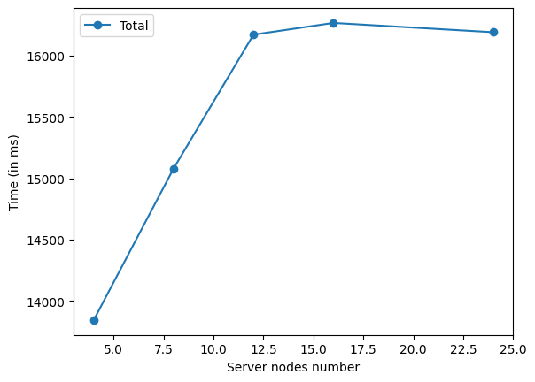

# SLR207

> Project of SLR207 at Télécom Paris - **Bezkhodarnov Nikolay**

Main object of this program is to count words from a file via mapreduce algorithm.

## Implementation

### Communication

All the communication (between the servers and between the servers and master) is implemented via sockets.

### Launch

First, it's required to launch all servers nodes. After that, master node should be launched with a configuration file named "configuration.txt" that includes a list of addresses of the server nodes with ports that they listen.

### Mapping

Master node split file equally by bytes (except few bytes required to finish a word between text segments) and sends them to server nodes in the ratio 'one split per server node'.

### Shuffling

Master node spreads a list of remainders (from division of hash code by servers number) that servers should handle. After that each server node handles words with its own remainder got from division of hash code by servers number and sends all other words to other servers, according to the list.

> reduce step is applied automatically due to hashmap

### SortShuffling

This step is used to sort result by counts. Master node asks all the servers for min and max counts and finds overall min and max of it. Then, master node spreads a list of min and max that each server node should handle. After that server nodes handle words with counts in their own min-max range and sends words in other ranges to other servers.

> reduce step is applied automatically due to hashmap

### Result

Master node asks each server node for the result and outputs it in a console.

> After the output of result, master node sends signal to shutdown all the servers.

### Progress output

To make the program more or less verbose, it's possible to set required LogLevel in a Logger class by path "src/main/java/com/mapreduce/Logger.java". To output the progress messages, it's required to set LogLevel at leasd to the level "Info".

## Instruction for launching

Here is the 'deploy.sh' script that launches the program. It's required to launch the script with following arguments
- ssh login
- path to file (to count words)
- number of server nodes (excluding master node)

It will automatically build the program, make a list of available computers in Télécom Paris, generate configuration file and launch the server nodes and the master node.

> Note that this script builds executable jar files on a local machine. Be sure that your system has java, apache, maven, and the same achitecture that on servers.

## Results

### For a file (300MB) ``"/cal/commoncrawl/CC-MAIN-20230321002050-20230321032050-00486.warc.wet"``

Number of server nodes:
- 4: 8843ms.
- 8: 10080ms.
- 12: 11172ms.
- 16: 11268ms.
- 24: 11192ms.

### Plot

## Conclusion

Performance does not always increase with the number of servers. When there are too many servers, the communication time begins to exceed the computing time, which is why the performance stops growing.
